# Architecture Documentation

## System Architecture Diagram

The AWS Infographic Generator follows a multi-agent architecture pattern using AWS Strands framework and AWS services.

```mermaid
graph TB
    %% User Interface Layer
    User[👤 User Input<br/>Text Content] --> CLI[🖥️ CLI Interface<br/>main.py]
    User --> API[🌐 API Interface<br/>FastAPI/Lambda]
    
    %% Orchestration Layer
    CLI --> Orchestrator[🎯 InfographicOrchestrator<br/>Workflow Coordination]
    API --> Orchestrator
    
    %% Agent Layer
    Orchestrator --> ContentAgent[📝 ContentAnalyzer<br/>Text Analysis & Structure]
    Orchestrator --> ImageAgent[🖼️ ImageSourcer<br/>Image Generation & Sourcing]
    Orchestrator --> LayoutAgent[🎨 DesignLayout<br/>Visual Layout Design]
    Orchestrator --> TextAgent[✍️ TextFormatter<br/>Typography & Styling]
    Orchestrator --> ComposerAgent[🖌️ ImageComposer<br/>Final Image Creation]
    
    %% AWS Services Layer
    ContentAgent --> Bedrock1[🧠 Amazon Bedrock<br/>Claude 3.5 Sonnet<br/>Content Analysis]
    ImageAgent --> NovaCanvas[🎨 Amazon Nova Canvas<br/>AI Image Generation]
    LayoutAgent --> Bedrock2[🧠 Amazon Bedrock<br/>Claude 3.5 Sonnet<br/>Layout Intelligence]
    
    %% Storage and Processing
    ImageAgent --> S3Cache[📦 Amazon S3<br/>Image Asset Cache]
    ComposerAgent --> PIL[🖼️ PIL/Pillow<br/>Image Composition]
    ComposerAgent --> S3Output[📤 Amazon S3<br/>Final Output Storage]
    
    %% Output Layer
    S3Output --> URLs[🔗 Shareable URLs<br/>Platform Optimized]
    
    %% Platform Outputs
    URLs --> WhatsApp[📱 WhatsApp<br/>1080x1080 Square]
    URLs --> Twitter[🐦 Twitter<br/>1200x675 Landscape]
    URLs --> Discord[💬 Discord<br/>1920x1080 HD]
    URLs --> General[🌐 General<br/>1920x1080 Universal]
    
    %% Tool Layer (Supporting Services)
    subgraph "Tools & Utilities"
        ContentTools[📊 Content Tools<br/>Analysis Utilities]
        ImageTools[🛠️ Image Tools<br/>Processing Utilities]
        LayoutTools[📐 Layout Tools<br/>Positioning Calculations]
        TextTools[🔤 Text Tools<br/>Font & Styling]
        S3Tools[📦 S3 Tools<br/>Upload/Download]
        BedrockTools[🔧 Bedrock Tools<br/>Model Invocation]
    end
    
    %% Tool Connections
    ContentAgent -.-> ContentTools
    ContentAgent -.-> BedrockTools
    ImageAgent -.-> ImageTools
    ImageAgent -.-> S3Tools
    LayoutAgent -.-> LayoutTools
    LayoutAgent -.-> BedrockTools
    TextAgent -.-> TextTools
    ComposerAgent -.-> S3Tools
    
    %% Monitoring & Logging
    subgraph "Observability"
        CloudWatch[📊 CloudWatch<br/>Metrics & Logs]
        Monitoring[📈 Performance<br/>Monitoring]
    end
    
    Orchestrator -.-> CloudWatch
    S3Output -.-> CloudWatch
    
    %% Styling
    classDef userLayer fill:#e1f5fe,stroke:#01579b,stroke-width:2px
    classDef orchestrationLayer fill:#f3e5f5,stroke:#4a148c,stroke-width:2px
    classDef agentLayer fill:#e8f5e8,stroke:#1b5e20,stroke-width:2px
    classDef awsLayer fill:#fff3e0,stroke:#e65100,stroke-width:2px
    classDef storageLayer fill:#fce4ec,stroke:#880e4f,stroke-width:2px
    classDef outputLayer fill:#f1f8e9,stroke:#33691e,stroke-width:2px
    classDef toolLayer fill:#f5f5f5,stroke:#424242,stroke-width:1px
    
    class User,CLI,API userLayer
    class Orchestrator orchestrationLayer
    class ContentAgent,ImageAgent,LayoutAgent,TextAgent,ComposerAgent agentLayer
    class Bedrock1,Bedrock2,NovaCanvas awsLayer
    class S3Cache,S3Output,PIL storageLayer
    class URLs,WhatsApp,Twitter,Discord,General outputLayer
    class ContentTools,ImageTools,LayoutTools,TextTools,S3Tools,BedrockTools toolLayer
```

## Data Flow Architecture

## Component Architecture

### Agent Framework (AWS Strands)

### AWS Service Integration

## Security Architecture

## Deployment Architecture

### Local Development

### Production Deployment

## Performance Architecture

### Caching Strategy

### Scaling Strategy

## Error Handling Architecture

## Integration Patterns

### Event-Driven Architecture

### API Integration

## Technology Stack

### Core Technologies

| Layer | Technology | Purpose |
|-------|------------|---------|
| **Framework** | AWS Strands SDK | Multi-agent orchestration |
| **Language** | Python 3.12+ | Core application logic |
| **AI/ML** | Amazon Bedrock | Content analysis and reasoning |
| **Image Generation** | Amazon Nova Canvas | AI-powered image creation |
| **Image Processing** | PIL/Pillow | Image composition and manipulation |
| **Storage** | Amazon S3 | Asset storage and hosting |
| **Monitoring** | Amazon CloudWatch | Metrics, logs, and alerting |

### Development Tools

| Category | Tool | Purpose |
|----------|------|---------|
| **Package Management** | uv | Fast Python package management |
| **Testing** | pytest | Unit and integration testing |
| **Code Quality** | black, isort, mypy | Code formatting and type checking |
| **Documentation** | Sphinx | API documentation generation |
| **Containerization** | Docker | Application packaging |
| **Infrastructure** | AWS CDK | Infrastructure as Code |

### AWS Services Used

| Service | Usage | Configuration |
|---------|-------|---------------|
| **Amazon Bedrock** | Content analysis, layout intelligence | Claude 3.5 Sonnet model |
| **Amazon Nova Canvas** | AI image generation | Text-to-image generation |
| **Amazon S3** | Asset storage, output hosting | Bucket with public read access |
| **AWS Lambda** | Serverless execution (optional) | Python 3.12 runtime |
| **Amazon CloudWatch** | Monitoring and logging | Custom metrics and dashboards |
| **AWS IAM** | Access control | Least privilege policies |

This architecture provides a scalable, maintainable, and AWS-native solution for automated infographic generation using modern AI services and best practices.