# AWS Infographic Generator - Architecture Diagrams

This document contains comprehensive architecture diagrams for the AWS Infographic Generator system.

## System Overview Diagram

```mermaid
graph TB
    %% User Interface Layer
    subgraph "User Interface Layer"
        User[👤 User]
        CLI[🖥️ CLI Interface]
        API[🌐 REST API]
        WebUI[🌍 Web Interface]
    end
    
    %% Application Layer
    subgraph "Application Layer"
        Orchestrator[🎯 InfographicOrchestrator<br/>Main Workflow Controller]
        
        subgraph "Specialized Agents"
            ContentAgent[📝 ContentAnalyzer<br/>Text Analysis & Structure]
            ImageAgent[🖼️ ImageSourcer<br/>Image Generation & Sourcing]
            LayoutAgent[🎨 DesignLayout<br/>Visual Layout Design]
            TextAgent[✍️ TextFormatter<br/>Typography & Styling]
            ComposerAgent[🖌️ ImageComposer<br/>Final Image Creation]
        end
        
        subgraph "Tool Layer"
            ContentTools[📊 Content Tools]
            ImageTools[🛠️ Image Tools]
            LayoutTools[📐 Layout Tools]
            TextTools[🔤 Text Tools]
            S3Tools[📦 S3 Tools]
            BedrockTools[🔧 Bedrock Tools]
        end
    end
    
    %% AWS Services Layer
    subgraph "AWS Services"
        subgraph "AI/ML Services"
            Bedrock[🧠 Amazon Bedrock<br/>Claude 3.5 Sonnet]
            NovaCanvas[🎨 Amazon Nova Canvas<br/>Image Generation]
        end
        
        subgraph "Storage Services"
            S3[📦 Amazon S3<br/>Asset Storage & Hosting]
        end
        
        subgraph "Monitoring Services"
            CloudWatch[📊 Amazon CloudWatch<br/>Metrics & Logs]
            XRay[🔍 AWS X-Ray<br/>Distributed Tracing]
        end
    end
    
    %% Data Processing Layer
    subgraph "Data Processing"
        PIL[🖼️ PIL/Pillow<br/>Image Processing]
        Cache[💾 In-Memory Cache<br/>Performance Optimization]
    end
    
    %% Output Layer
    subgraph "Output Formats"
        WhatsApp[📱 WhatsApp<br/>1080x1080]
        Twitter[🐦 Twitter<br/>1200x675]
        Discord[💬 Discord<br/>1920x1080]
        General[🌐 General<br/>1920x1080]
    end
    
    %% Connections
    User --> CLI
    User --> API
    User --> WebUI
    
    CLI --> Orchestrator
    API --> Orchestrator
    WebUI --> Orchestrator
    
    Orchestrator --> ContentAgent
    Orchestrator --> ImageAgent
    Orchestrator --> LayoutAgent
    Orchestrator --> TextAgent
    Orchestrator --> ComposerAgent
    
    ContentAgent --> ContentTools
    ImageAgent --> ImageTools
    LayoutAgent --> LayoutTools
    TextAgent --> TextTools
    ComposerAgent --> S3Tools
    
    ContentTools --> BedrockTools
    ImageTools --> BedrockTools
    S3Tools --> BedrockTools
    
    BedrockTools --> Bedrock
    ImageTools --> NovaCanvas
    S3Tools --> S3
    
    ComposerAgent --> PIL
    ImageAgent --> Cache
    
    Orchestrator --> CloudWatch
    Orchestrator --> XRay
    
    ComposerAgent --> WhatsApp
    ComposerAgent --> Twitter
    ComposerAgent --> Discord
    ComposerAgent --> General
    
    %% Styling
    classDef userLayer fill:#e1f5fe,stroke:#01579b,stroke-width:2px
    classDef appLayer fill:#f3e5f5,stroke:#4a148c,stroke-width:2px
    classDef agentLayer fill:#e8f5e8,stroke:#1b5e20,stroke-width:2px
    classDef toolLayer fill:#fff3e0,stroke:#e65100,stroke-width:2px
    classDef awsLayer fill:#fce4ec,stroke:#880e4f,stroke-width:2px
    classDef dataLayer fill:#f1f8e9,stroke:#33691e,stroke-width:2px
    classDef outputLayer fill:#f5f5f5,stroke:#424242,stroke-width:2px
    
    class User,CLI,API,WebUI userLayer
    class Orchestrator appLayer
    class ContentAgent,ImageAgent,LayoutAgent,TextAgent,ComposerAgent agentLayer
    class ContentTools,ImageTools,LayoutTools,TextTools,S3Tools,BedrockTools toolLayer
    class Bedrock,NovaCanvas,S3,CloudWatch,XRay awsLayer
    class PIL,Cache dataLayer
    class WhatsApp,Twitter,Discord,General outputLayer
```

## Data Flow Sequence Diagram

## AWS Services Integration Architecture

## Security Architecture Diagram

```mermaid
graph TB
    subgraph "External Access"
        Internet[🌐 Internet]
        Users[👥 Users]
    end
    
    subgraph "AWS Security Perimeter"
        subgraph "Network Security"
            WAF[🛡️ AWS WAF<br/>Web Application Firewall]
            ALB[⚖️ Application Load Balancer<br/>SSL Termination]
            VPC[🏠 Amazon VPC<br/>Network Isolation]
            
            subgraph "Private Subnets"
                ECS[📦 ECS Tasks<br/>Application Containers]
                Lambda[⚡ Lambda Functions<br/>Serverless Compute]
            end
            
            subgraph "Security Groups"
                SGALB[🔒 ALB Security Group<br/>HTTPS Only]
                SGECS[🔒 ECS Security Group<br/>Internal Traffic]
            end
        end
        
        subgraph "Identity & Access Management"
            IAM[👤 AWS IAM<br/>Identity Management]
            
            subgraph "IAM Roles"
                ECSRole[🎭 ECS Task Role<br/>Bedrock + S3 Access]
                LambdaRole[🎭 Lambda Execution Role<br/>Limited Permissions]
            end
            
            subgraph "IAM Policies"
                BedrockPolicy[📋 Bedrock Access Policy<br/>Model Invocation Only]
                S3Policy[📋 S3 Access Policy<br/>Bucket-Specific Access]
            end
        end
        
        subgraph "Data Protection"
            KMS[🔐 AWS KMS<br/>Encryption Key Management]
            
            subgraph "Encryption"
                S3Encryption[🔒 S3 Server-Side Encryption<br/>AES-256 / KMS]
                TransitEncryption[🔒 TLS 1.2+ Encryption<br/>Data in Transit]
            end
        end
        
        subgraph "Monitoring & Compliance"
            CloudTrail[📊 AWS CloudTrail<br/>API Audit Logging]
            Config[⚙️ AWS Config<br/>Compliance Monitoring]
            GuardDuty[🛡️ Amazon GuardDuty<br/>Threat Detection]
            
            subgraph "Logging"
                CloudWatchLogs[📝 CloudWatch Logs<br/>Application Logs]
                VPCFlowLogs[🌊 VPC Flow Logs<br/>Network Traffic]
            end
        end
    end
    
    subgraph "AWS Services"
        Bedrock[🧠 Amazon Bedrock<br/>Foundation Models]
        S3[📦 Amazon S3<br/>Encrypted Storage]
        CloudWatch[📊 Amazon CloudWatch<br/>Metrics & Monitoring]
    end
    
    %% External connections
    Users --> Internet
    Internet --> WAF
    
    %% Network flow
    WAF --> ALB
    ALB --> VPC
    VPC --> ECS
    VPC --> Lambda
    
    %% Security group associations
    ALB -.-> SGALB
    ECS -.-> SGECS
    
    %% IAM associations
    ECS --> ECSRole
    Lambda --> LambdaRole
    ECSRole --> BedrockPolicy
    ECSRole --> S3Policy
    LambdaRole --> S3Policy
    
    %% Service access
    ECS --> Bedrock
    ECS --> S3
    Lambda --> S3
    ECS --> CloudWatch
    Lambda --> CloudWatch
    
    %% Encryption
    S3 --> S3Encryption
    S3Encryption --> KMS
    ALB --> TransitEncryption
    
    %% Monitoring
    ECS --> CloudWatchLogs
    VPC --> VPCFlowLogs
    Bedrock --> CloudTrail
    S3 --> CloudTrail
    IAM --> CloudTrail
    VPC --> Config
    VPC --> GuardDuty
    
    %% Styling
    classDef external fill:#ffcdd2,stroke:#d32f2f,stroke-width:2px
    classDef network fill:#e3f2fd,stroke:#1976d2,stroke-width:2px
    classDef security fill:#f3e5f5,stroke:#7b1fa2,stroke-width:2px
    classDef encryption fill:#e8f5e8,stroke:#388e3c,stroke-width:2px
    classDef monitoring fill:#fff3e0,stroke:#f57c00,stroke-width:2px
    classDef services fill:#fce4ec,stroke:#c2185b,stroke-width:2px
    
    class Internet,Users external
    class WAF,ALB,VPC,ECS,Lambda,SGALB,SGECS network
    class IAM,ECSRole,LambdaRole,BedrockPolicy,S3Policy security
    class KMS,S3Encryption,TransitEncryption encryption
    class CloudTrail,Config,GuardDuty,CloudWatchLogs,VPCFlowLogs monitoring
    class Bedrock,S3,CloudWatch services
```

## Deployment Architecture Options

### Option 1: Serverless Deployment

```mermaid
graph TB
    subgraph "Serverless Architecture"
        subgraph "API Gateway"
            APIGW[🌐 Amazon API Gateway<br/>REST API Endpoints]
        end
        
        subgraph "Compute Layer"
            LambdaOrchestrator[⚡ Lambda Function<br/>Orchestrator]
            LambdaContent[⚡ Lambda Function<br/>Content Analyzer]
            LambdaImage[⚡ Lambda Function<br/>Image Sourcer]
            LambdaLayout[⚡ Lambda Function<br/>Layout Designer]
            LambdaComposer[⚡ Lambda Function<br/>Image Composer]
        end
        
        subgraph "Event Processing"
            SQS[📬 Amazon SQS<br/>Task Queue]
            EventBridge[🎯 Amazon EventBridge<br/>Event Routing]
        end
        
        subgraph "Storage & Services"
            S3[📦 Amazon S3<br/>Asset Storage]
            Bedrock[🧠 Amazon Bedrock<br/>AI Models]
            DynamoDB[🗄️ Amazon DynamoDB<br/>State Management]
        end
        
        subgraph "Monitoring"
            CloudWatch[📊 CloudWatch<br/>Logs & Metrics]
            XRay[🔍 X-Ray<br/>Tracing]
        end
    end
    
    %% API flow
    APIGW --> LambdaOrchestrator
    
    %% Event-driven processing
    LambdaOrchestrator --> EventBridge
    EventBridge --> SQS
    SQS --> LambdaContent
    SQS --> LambdaImage
    SQS --> LambdaLayout
    SQS --> LambdaComposer
    
    %% Service connections
    LambdaContent --> Bedrock
    LambdaImage --> Bedrock
    LambdaLayout --> Bedrock
    LambdaComposer --> S3
    LambdaOrchestrator --> DynamoDB
    
    %% Monitoring
    LambdaOrchestrator --> CloudWatch
    LambdaContent --> XRay
    LambdaImage --> XRay
    LambdaLayout --> XRay
    LambdaComposer --> XRay
    
    classDef serverless fill:#fff3e0,stroke:#f57c00,stroke-width:2px
    class APIGW,LambdaOrchestrator,LambdaContent,LambdaImage,LambdaLayout,LambdaComposer,SQS,EventBridge serverless
```

### Option 2: Container Deployment

## Performance and Scaling Architecture

```mermaid
graph TB
    subgraph "Performance Optimization"
        subgraph "Caching Layers"
            CDN[🌐 Amazon CloudFront<br/>Global CDN]
            ElastiCache[⚡ Amazon ElastiCache<br/>Redis Cache]
            S3Cache[📦 S3 Cache Bucket<br/>Generated Assets]
            MemoryCache[💾 In-Memory Cache<br/>Application Level]
        end
        
        subgraph "Load Distribution"
            ALB[⚖️ Application Load Balancer<br/>Multi-AZ Distribution]
            
            subgraph "Auto Scaling Groups"
                ASGOrch[📈 Orchestrator ASG<br/>2-10 instances]
                ASGWorkers[📈 Worker ASG<br/>5-20 instances]
            end
        end
        
        subgraph "Processing Optimization"
            SQS[📬 Amazon SQS<br/>Task Distribution]
            
            subgraph "Worker Types"
                ContentWorkers[👷 Content Workers<br/>CPU Optimized]
                ImageWorkers[👷 Image Workers<br/>Memory Optimized]
                ComposerWorkers[👷 Composer Workers<br/>GPU Optimized]
            end
        end
        
        subgraph "Data Optimization"
            S3IA[📦 S3 Intelligent Tiering<br/>Cost Optimization]
            S3Transfer[🚀 S3 Transfer Acceleration<br/>Global Upload Speed]
            
            subgraph "Database Optimization"
                DynamoDAX[⚡ DynamoDB + DAX<br/>Microsecond Latency]
                RDSReadReplicas[🗄️ RDS Read Replicas<br/>Read Scaling]
            end
        end
        
        subgraph "Monitoring & Optimization"
            CloudWatch[📊 CloudWatch<br/>Performance Metrics]
            
            subgraph "Performance Insights"
                AppInsights[📈 Application Insights<br/>Performance Analysis]
                CostOptimizer[💰 Cost Optimizer<br/>Resource Right-sizing]
            end
        end
    end
    
    %% Traffic flow
    CDN --> ALB
    ALB --> ASGOrch
    ASGOrch --> SQS
    
    %% Worker distribution
    SQS --> ContentWorkers
    SQS --> ImageWorkers
    SQS --> ComposerWorkers
    
    %% Caching hierarchy
    ContentWorkers --> MemoryCache
    ImageWorkers --> ElastiCache
    ComposerWorkers --> S3Cache
    S3Cache --> CDN
    
    %% Auto scaling
    ASGOrch --> ASGWorkers
    ContentWorkers -.-> ASGWorkers
    ImageWorkers -.-> ASGWorkers
    ComposerWorkers -.-> ASGWorkers
    
    %% Data access optimization
    ContentWorkers --> DynamoDAX
    ImageWorkers --> S3Transfer
    ComposerWorkers --> S3IA
    ASGOrch --> RDSReadReplicas
    
    %% Monitoring
    ASGOrch --> CloudWatch
    ContentWorkers --> AppInsights
    ImageWorkers --> AppInsights
    ComposerWorkers --> CostOptimizer
    
    classDef performance fill:#e8f5e8,stroke:#388e3c,stroke-width:2px
    classDef scaling fill:#fff3e0,stroke:#f57c00,stroke-width:2px
    classDef optimization fill:#f3e5f5,stroke:#7b1fa2,stroke-width:2px
    classDef monitoring fill:#e3f2fd,stroke:#1976d2,stroke-width:2px
    
    class CDN,ElastiCache,S3Cache,MemoryCache performance
    class ALB,ASGOrch,ASGWorkers,SQS,ContentWorkers,ImageWorkers,ComposerWorkers scaling
    class S3IA,S3Transfer,DynamoDAX,RDSReadReplicas optimization
    class CloudWatch,AppInsights,CostOptimizer monitoring
```

These architecture diagrams provide comprehensive visual documentation of the AWS Infographic Generator system, covering system overview, data flow, AWS services integration, security, deployment options, and performance optimization strategies.